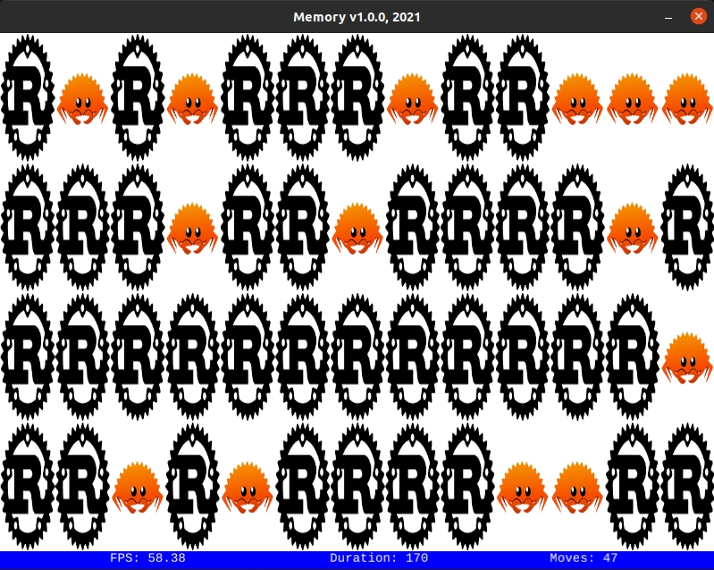

# Memory v1

## Description

Concentration, also known as Matching Pairs, Match Match, Match Up, Memory, Pleonasm, Shank, Pexeso or simply Pairs, is a card game in which all of the cards are laid face down on a surface and two cards are flipped face up over each turn. The object of the game is to turn over pairs of matching cards.



## Dependencies

* [Good Web Game](https://github.com/ggez/good-web-game)


## Build and run

```
cargo build --release

cargo run --release
```

## Author

* [Antonio Soares](https://github.com/ccie18473)

## License

This project is licensed under the [MIT] License - see the LICENSE.md file for details

